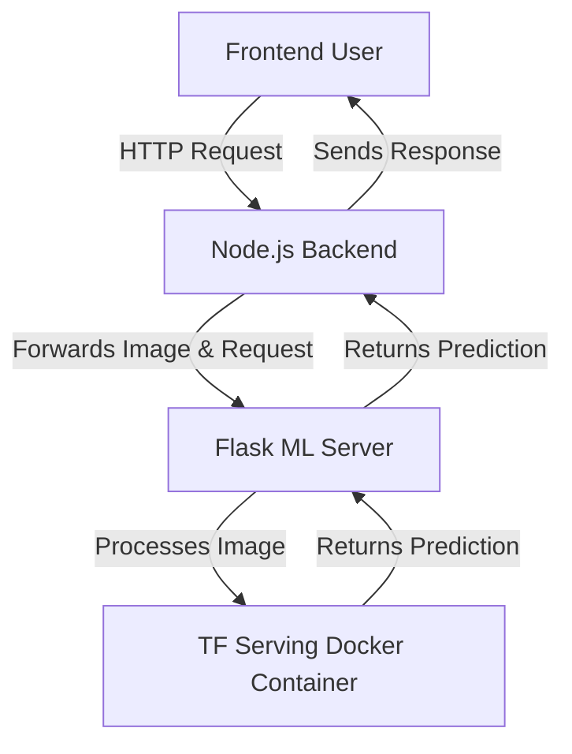
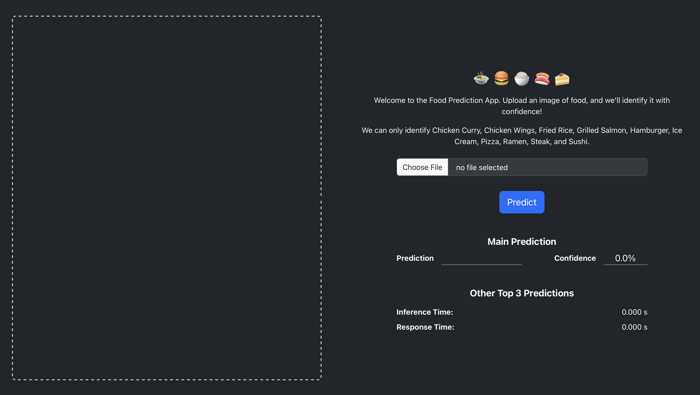
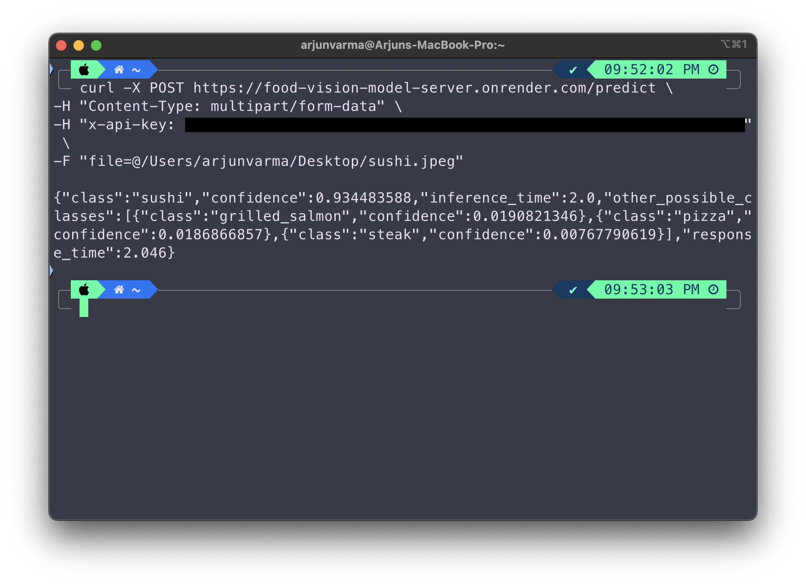
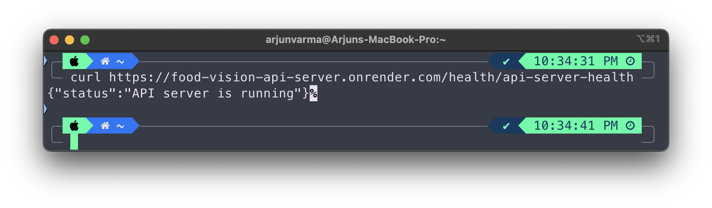
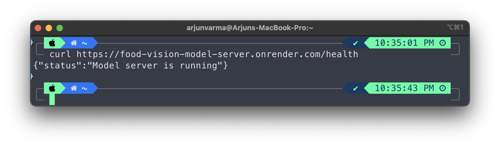
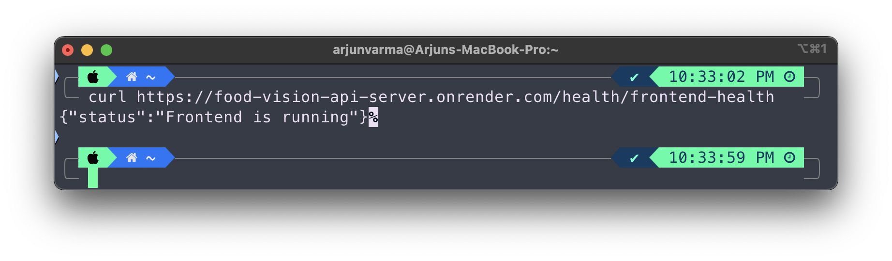

# **FoodVision** 🍔🍕🍰  
## Scalable Food Image Classification with TensorFlow, Flask, and Node.js

---

### **Overview**
FoodVision is a full-stack food image classification application designed for scalability, clean code separation, and production efficiency. The project leverages the pretrained EfficientNet80 model fine tuned to fit a dataset with 10,000 images resulting in a **Convolutional Neural Network (CNN)** built with TensorFlow to predict food categories from images. 

To showcase industry-standard architecture, the application adopts a **microservices approach**:
1. **Tensorflow serving:** Serves the TensorFlow-trained model for image predictions.
2. **Flask (Python)**: Performs image processing on the input, preparing it for the tensorflow model.
3. **Node.js/Express**: Manages API routing, user requests, and communication with the Flask model server.
4. **(Optional) React.js Frontend**: Allows users to upload images, visualize predictions, and interact with the backend seamlessly.

---

### **Features** 🚀

- **State-of-the-Art CNN Model**: A trained TensorFlow model for food classification using the **Food-101 dataset**.
- **Microservices Architecture**: Separation of concerns using a Flask model server and a Node.js API server.
- **Scalable & Efficient**: Designed to easily scale with additional servers or containers.
- **Clean Code Separation**: Well-organized Python and Node.js codebases for easy maintenance and debugging.
- **RESTful APIs**: Interaction between components happens through clean, standardized RESTful endpoints.
- **Modern Tech Stack**:
  - **Backend**: Flask, Node.js, Express, TensorFlow
  - **Frontend** (Optional): React.js
- **Production-Ready Design**: Deployment-friendly structure for cloud platforms like **AWS**, **Heroku**, or **Docker**.

---

### **Project Architecture** 🛠️

description FoodVision Project Architecture


1. **Node.js/Express (Backend Server)**:
  - Manages incoming HTTP requests from the frontend.
  - Handles web-related tasks such as authentication and request routing.
  - Acts as a bridge between the frontend and the model server (Flask).

2. **Flask (Model Server)**:
  - Prepares incoming images for processing.
  - Communicates with the TF Serving Docker container for predictions.
  - Returns processed predictions to the backend server.

3. **TF Serving (Prediction Service)**:
  - Hosts and serves the TensorFlow model for efficient predictions.
  - Optimized for both CPU and GPU-bound tasks to handle model inference.

4. **React.js (Frontend)**:
  - Provides a user-friendly interface for uploading images.
  - Displays the prediction results received from the backend server.

---

## **Why This Architecture?** 💡

1. **Scalability**:  
   - The **Node.js backend**, **Flask server**, and **TF Serving Docker container** can be scaled **independently**.  
   - For heavy prediction loads, multiple TF Serving containers and Flask servers can be deployed behind a load balancer.  

2. **Clean Code Separation**:  
   - **Node.js backend** handles web-related tasks like routing, authentication, and rate limiting.  
   - **Flask server** focuses on image preparation and communication with the TF Serving container.  
   - **TF Serving** is optimized solely for model inference, ensuring modularity.  

3. **Efficiency**:  
   - **TF Serving** is optimized for high-performance TensorFlow model inference on both CPU and GPU.  
   - **Flask server** ensures efficient preprocessing and prediction response handling.  
   - **Node.js** provides fast, event-driven handling of client requests, ensuring seamless user interaction.  

4. **Microservices Design**:  
   - Aligns with modern production-ready architectures widely used in industry.  
   - Separates concerns into distinct services, making the system modular, easier to debug, maintain, and scale.

---

### **Tech Stack** 🛠️

| **Component**          | **Technology**               |
|------------------------|------------------------------|
| **Tensorflow serving** | TensorFlow, Keras, Python    |
| **ML Server**          | Flask, TensorFlow Serving    |
| **API Server**         | Node.js, Express.js          |
| **Frontend**           | React.js                     |
| **Deployment**         | AWS, Heroku, Docker          |

---

### **Installation Guide** ⚙️

Follow these steps to set up the project locally.

### **Setup Instructions for FoodVision**

#### **1. Clone the Repository**
```bash
git clone https://github.com/ArjunXvarma/foodvision.git
cd foodvision
```

---

#### **2. Setup TensorFlow Serving Docker**
1. Ensure Docker is installed and running on your system.  
   If not, install Docker by following [Docker's installation guide](https://docs.docker.com/get-docker/).  

2. Build the TensorFlow Serving Docker image:
   ```bash
   docker build -f Dockerfile.tf_serve -t food_pred_tf_serve .
   ```

3. Run the Docker container:
   ```bash
   docker run -p 8501:8501 --name food_pred_service food_pred_tf_serve
   ```

---

#### **3. Setup Flask ML Server**
1. Navigate to the Flask directory:
   ```bash
   cd model-server
   ```
2. Install dependencies:
   ```bash
   pip install -r requirements.txt
   ```
3. Update the Flask server configuration to point to the TensorFlow Serving REST API:
   - Open `app.py` and ensure the endpoint for TensorFlow Serving is set to:
     ```
     http://localhost:8501/v1/models/food_pred:predict
     ```
4. Run the Flask server:
   ```bash
   python app.py
   ```

---

#### **4. Setup Node.js API Server**
1. Navigate to the Node.js directory:
   ```bash
   cd ../api-server
   ```
2. Install dependencies:
   ```bash
   npm install
   ```
3. Run the Node.js server:
   ```bash
   node server.js
   ```

---

#### **5. (Optional) Run React Frontend**
1. Navigate to the frontend directory:
   ```bash
   cd ../frontend
   ```
2. Install dependencies:
   ```bash
   npm install
   ```
3. Run the frontend:
   ```bash
   npm run build && npm run preview
   ```

### **Quick Start with Docker Compose** 🐳

1. **Ensure Docker and Docker Compose are installed**:
   - Follow [Docker Installation Guide](https://docs.docker.com/get-docker/).

2. **Start the services**:
   - Build and run all services using Docker Compose:
     ```bash
     docker-compose up --build
     ```

3. **Access the application**:
   - The API server will be available at [http://localhost:3000](http://localhost:3000).  
   - The Flask server will be available at [http://localhost:5000](http://localhost:5000).  
   - If the frontend is enabled, it will run at [http://localhost:8080](http://localhost:8080).  
   - If the tf serving server is enabled, it will run at [http://127.0.0.1:8501/v1/models/food_pred:predict](http://127.0.0.1:8501/v1/models/food_pred:predict).

4. **Stop the services**:
   - Stop all containers with:
     ```bash
     docker-compose down

---

### **Quick Tips**
- Use `docker ps` to ensure the TensorFlow Serving container is running.
- If needed, stop the TensorFlow Serving container with:
  ```bash
  docker stop food_pred_service
  ```
- Restart it with:
  ```bash
  docker start food_pred_service
  ```  

This setup ensures the TensorFlow Serving, Flask ML server, Node.js API server, and React frontend are properly connected and functional.

---

### **API Endpoints** 🌐

| **Endpoint**                              | **Method** | **Description**                                        | **Header**                      |
|-------------------------------------------|------------|--------------------------------------------------------|----------------------------------|
| `/predict`                                | POST       | Upload an image and get a prediction.                 | `x-api-key`: include an API key |
| `{api-server}/health/api-server-health`               | GET        | Health check for the API server.                      | None                            |
| `{model-server}/health`                                 | GET        | Health check for the model server.                    | None                            |
| `{api-server}/health/frontend-health`                 | GET        | Health check for the frontend server.                 | None                            |
| Root URL of `TF Model Serving Service`    | GET        | Health check or default endpoint for TF Serving.      | None                            |


> **Note:** Both the Node.js server and the Flask server have a `/predict` API that functions in the same way.

---

### **Future Improvements** 🚀
- Add **user authentication** and **history tracking** for predictions.
- Add **TensorFlow.js** support to allow in-browser model inference.
- Using premium services like AWS/GCP for better **response times** 

---

### **Keep-Alive Cronjob** ⏰

In production environments, ensuring that servers remain active and responsive is crucial to avoid idle timeouts and guarantee quick responses to user requests. This is achieved by implementing a keep-alive cronjob. For this project, the cronjob is implemented using **GitHub Actions** to send periodic requests to the server endpoints. 

### **How the Keep-Alive Cronjob Works**

The keep-alive script, written in **Node.js**, sends HTTP requests to health check endpoints for all essential services. This process prevents the servers from becoming idle due to inactivity.

### **How the Script Works**

The script can be found in the cron jobs folder

1. **Services Configuration**:  
   The `services` array contains the list of services with:
   - A **name** for identifying the service.
   - A **URL** pointing to the health check endpoint.

2. **Request Execution**:  
   - The `keepAlive` function iterates over each service in the `services` array.
   - It sends a `GET` request to the health check URL using **Axios**.
   - If the request is successful, the script logs the service status (`200 - OK`).
   - If an error occurs, the script logs the error message for debugging.

3. **Execution and Scheduling**:  
   - The script runs once during execution by the GitHub Actions workflow.
   - GitHub Actions schedules it periodically to keep the services alive.

### **Benefits of the Keep-Alive Cronjob**

1. **Prevents Idle Timeouts**:  
   Ensures that servers remain active and do not shut down due to inactivity.  

2. **Improves Responsiveness**:  
   Servers respond quickly to user requests as they are already running.  

3. **Automated Monitoring**:  
   Logs any errors or downtime, making it easier to identify and resolve issues.  

4. **Cost-Efficient**:  
   Eliminates the need for manual intervention to keep the servers alive.

---

### **Screenshots** 🖼️  

Here are screenshots of the application showcasing the UI, API responses, and predictions:  

| **Screenshot**             | **Description**                             |  
|----------------------------|---------------------------------------------|  
|       | User-friendly React.js interface for image uploads. |  
|       | JSON response from the API server.       |  
|  | JSON response from the model server.    |  
|  | Health check response from the API server.          |  
|  | Health check response from the model server.        |  
|  | Health check response from the frontend server.     |  

---

### **Contact** 📧
If you have any questions or feedback, feel free to reach out:
- **GitHub**: [ArjunXvarma](https://github.com/ArjunXvarma)
- **Email**: arj15835@gmail.com

---

**Give this project a ⭐ if you find it helpful!**
